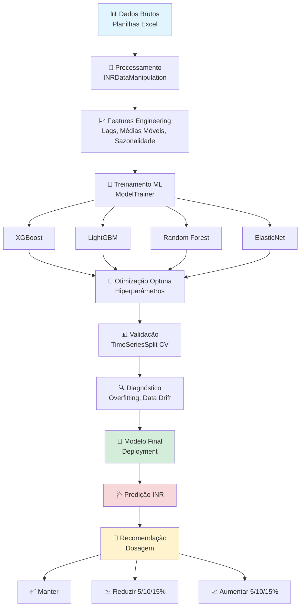

# 🩸 Predição de INR para Dosagem de Varfarina com Machine Learning

<div align="center">

[](https://www.python.org/downloads/)
[](https://scikit-learn.org/)
[](LICENSE)
[]()

Desenvolvido por **Pedro Cecato**<br>
Fornecimento de dados brutos e informações médicas por **Ivson**<br>
Coordenado pelo professor **Zildomar**<br>
**[LabTEVE](http://www.de.ufpb.br/~labteve/) - Universidade Federal da Paraíba (UFPB)**

</div>

---

## 📋 Índice

- [Sobre o Projeto](#-sobre-o-projeto)
- [Problema Clínico](#-problema-clínico)
- [Solução Proposta](#-solução-proposta)
- [Arquitetura do Sistema](#-arquitetura-do-sistema)
- [Funcionalidades](#-funcionalidades)
- [Tecnologias Utilizadas](#-tecnologias-utilizadas)
- [Instalação](#-instalação)
- [Guia de Uso](#-guia-de-uso)
- [Estrutura do Projeto](#-estrutura-do-projeto)
- [Metodologia](#-metodologia)
- [Resultados](#-resultados)
- [Roadmap](#-roadmap)
- [Equipe](#-equipe)
- [Contribuindo](#-contribuindo)
- [Licença](#-licença)
- [Citação](#-citação)

---

## 🎯 Sobre o Projeto

O **Sistema de Predição de INR** é uma plataforma baseada em Machine Learning desenvolvida para auxiliar profissionais de saúde na **dosagem personalizada de varfarina** em pacientes anticoagulados.

### 🏥 Contexto Clínico

A **varfarina** é um anticoagulante amplamente utilizado para prevenir eventos tromboembólicos em pacientes com:
- Fibrilação atrial
- Trombose venosa profunda
- Embolia pulmonar
- Válvulas cardíacas mecânicas
- Outras condições de risco trombótico

O monitoramento é realizado através do **INR (International Normalized Ratio)**, que deve permanecer dentro de uma faixa terapêutica específica (geralmente 2.0-3.5) para garantir eficácia sem risco de sangramento.

### ⚠️ Desafios Atuais

- **Alta variabilidade individual** na resposta à varfarina
- **Janela terapêutica estreita** (risco de hemorragia ou trombose)
- **Ajustes empíricos** baseados em protocolos genéricos
- **Falta de ferramentas preditivas** personalizadas
- **Necessidade de monitoramento frequente** (custo e desconforto ao paciente)

---

## 💡 Problema Clínico

### 🔴 Desafios na Dosagem de Varfarina

| Problema | Impacto | Frequência |
|----------|---------|------------|
| **INR Fora da Faixa** | Risco de sangramento ou trombose | 30-50% dos pacientes |
| **Ajustes Empíricos** | Tempo prolongado para estabilização | Comum |
| **Variabilidade Individual** | Necessidade de monitoramento intensivo | Alta |
| **Interações Medicamentosas/Alimentares** | Flutuações imprevisíveis no INR | Frequente |

### 📊 Dados Importantes

- **~1-2% da população** faz uso de anticoagulantes orais
- **30-40% do tempo** fora da faixa terapêutica ideal em tratamentos convencionais
- **Risco de sangramento maior**: 1-3% ao ano
- **Custo elevado** de monitoramento frequente

---

## 🚀 Solução Proposta

### 🎯 Objetivo Principal

Desenvolver um **sistema inteligente de predição de INR** que:

1. **Prediz o valor futuro de INR** com base em:
   - Histórico de INR do paciente
   - Dosagem atual de varfarina
   - Características temporais (sazonalidade, tendências)
   - Padrões individuais de resposta

2. **Recomenda ajustes de dosagem** personalizados:
   - ✅ **Manter** dose atual
   - 📉 **Reduzir** em 5%, 10% ou 15%
   - 📈 **Aumentar** em 5%, 10% ou 15%

3. **Fornece confiabilidade** da predição:
   - Intervalos de confiança
   - Métricas de incerteza
   - Alertas de risco

### 🎁 Benefícios Esperados

- ✅ **Redução do tempo** fora da faixa terapêutica
- ✅ **Diminuição de eventos adversos** (sangramento/trombose)
- ✅ **Personalização** do tratamento
- ✅ **Redução de custos** com monitoramento
- ✅ **Melhora da qualidade de vida** do paciente

---

## 🏗️ Arquitetura do Sistema


---

## ✨ Funcionalidades

### 📊 1. Manipulação e Limpeza de Dados
```python
from data_manipulation import INRDataManipulation
```

**Recursos:**
- ✅ Leitura automática de Excel/CSV
- ✅ Interpolação semanal de dados faltantes
- ✅ Criação de features temporais (lags, médias móveis)
- ✅ Detecção e tratamento de outliers
- ✅ Visualização da série temporal

### 🔄 2. Processamento em Lote
```python
📂 datasets_union.ipynb
```

**Recursos:**
- ✅ Processamento paralelo de múltiplos arquivos
- ✅ Unificação de datasets com separações definidas de dados
- ✅ Visualização e tratamento dos dados

### 🤖 3. Treinamento com Machine Learning
```mermaid
from training_model import ModelTrainer
```

**Modelos Suportados:**
- 🌳 **XGBoost** - Gradient Boosting otimizado
- 💡 **LightGBM** - Gradient Boosting eficiente
- 🌲 **Random Forest** - Ensemble de árvores
- 📏 **ElasticNet** - Regressão linear regularizada

**Otimização Automática de Hiperparâmetros:**
- ✅ **Validação cruzada** temporal (TimeSeriesSplit)
- ✅ **Penalização de variância** nos scores
- ✅ **Visualizações** automáticas de otimização

**Diagnóstico e Validação:**
- 📊 MAE (Mean Absolute Error)
- 📊 RMSE (Root Mean Squared Error)
- 📊 R² Score
- 📊 Gap MAE (Treino vs Teste)
- 📊 KS Test p-value (Data Drift)

### 💾 6. Salvamento e Versionamento
```python
📂 trained_models/modelo_data
```

**Arquivos Salvos:**
- 📦 `model.pkl` - Modelo treinado
- 📄 `params.json` - Hiperparâmetros
- 📄 `metadata.json` - Métricas e informações
- 📄 `diagnostics.json` - Resultados de diagnóstico
- 📄 `README.txt` - Documentação de uso

### 💊 7. Sistema de Recomendação de Dosagem
```python
# Predição de INR
inr_predicted = model.predict(X_new)[0]
current_inr = last_inr_value
target_range = (2.5, 3.5)

# Sistema de decisão
recommendation = recommend_dose_adjustment(
    predicted_inr=inr_predicted,
    current_inr=current_inr,
    target_range=target_range,
    current_dose=current_dose
)

# Saída:
# {
#   'action': 'reduce',
#   'percentage': 10,
#   'new_dose': 40.5,  # mg/semana
#   'confidence': 0.85,
#   'reason': 'INR previsto acima da faixa terapêutica'
# }
```

**Ações Possíveis:**
- ✅ **Manter** - INR dentro da faixa (±10% da meta)
- 📉 **Reduzir** - INR acima da faixa
  - 5% - Levemente acima
  - 10% - Moderadamente acima
  - 15% - Significativamente acima
- 📈 **Aumentar** - INR abaixo da faixa
  - 5% - Levemente abaixo
  - 10% - Moderadamente abaixo
  - 15% - Significativamente abaixo

---

## 🛠️ Tecnologias Utilizadas

### 📚 Core Libraries

| Tecnologia | Versão | Uso |
|------------|--------|-----|
| **Python** | 3.8+ | Linguagem base |
| **pandas** | 1.5+ | Manipulação de dados |
| **NumPy** | 1.24+ | Computação numérica |
| **scikit-learn** | 1.3+ | ML básico e preprocessamento |

### 🤖 Machine Learning

| Tecnologia | Versão | Uso |
|------------|--------|-----|
| **XGBoost** | 2.0+ | Gradient Boosting |
| **LightGBM** | 4.0+ | Gradient Boosting eficiente |
| **Optuna** | 3.0+ | Otimização de hiperparâmetros |

### 📊 Visualização e Análise

| Tecnologia | Versão | Uso |
|------------|--------|-----|
| **Matplotlib** | 3.7+ | Gráficos base |
| **Seaborn** | 0.12+ | Visualizações estatísticas |
| **SciPy** | 1.10+ | Testes estatísticos |

### 💾 Armazenamento e I/O

| Tecnologia | Versão | Uso |
|------------|--------|-----|
| **openpyxl** | 3.1+ | Leitura/escrita Excel |
| **joblib** | 1.3+ | Serialização de modelos |

---

## 📥 Instalação

### Pré-requisitos

- Python 3.8 ou superior
- pip (gerenciador de pacotes Python)
- Git (opcional)

### Passo 1: Clonar o Repositório
```bash
git clone https://github.com/LabTEVE/inr-prediction.git
cd inr-prediction
```

### Passo 2: Criar Ambiente Virtual (Recomendado)
```bash
# Windows
python -m venv venv
venv\Scripts\activate

# Linux/Mac
python3 -m venv venv
source venv/bin/activate
```

### Passo 3: Instalar Dependências
```bash
pip install -r requirements.txt
```

### Passo 4: Verificar Instalação
```bash
python -c "import xgboost, lightgbm, optuna; print('✅ Instalação bem-sucedida!')"
```

---

## 📖 Guia de Uso

### 🎬 Tutorial Completo

#### 1️⃣ Preparar Dados
```python
from data_manipulation import INRDataManipulation

# Processar dados de um paciente
inr_data = INRDataManipulation(
    path="data/paciente_001.xlsx",
    sheet_name="TTR"
)

# Obter dataset processado
data_final = inr_data.get_data_final()
features = inr_data.get_features_inr()

# Visualizar série temporal
inr_data.plot_inr()
```

#### 2️⃣ Dividir Dados (Temporal Split)
```python
import pandas as pd

# Split temporal: 80% treino, 20% teste
split_index = int(len(data_final) * 0.8)

train_data = data_final.iloc[:split_index]
test_data = data_final.iloc[split_index:]

X_train = train_data[features]
y_train = train_data['inr']

X_test = test_data[features]
y_test = test_data['inr']
```

#### 3️⃣ Treinar Modelos
```python
from training_model import ModelTrainer

# Inicializar treinador
trainer = ModelTrainer(X_train, y_train, random_state=42, n_splits=5)

# Treinar múltiplos modelos
results = trainer.train_all_models(
    n_trials_dict={
        'xgboost': 100,
        'lightgbm': 100,
        'randomforest': 80,
        'elasticnet': 60
    }
)
```

#### 4️⃣ Avaliar e Diagnosticar
```python
# Diagnosticar cada modelo
for model_name, (params, model, study, *rest) in results.items():
    scaler = rest[0] if rest and model_name == "ElasticNet" else None
    
    diagnostics = trainer.diagnose_model(
        model=model,
        X_test=X_test,
        y_test=y_test,
        model_name=model_name,
        scaler=scaler
    )

# Comparar todos os modelos
trainer.compare_all_models()
```

#### 5️⃣ Selecionar e Salvar Melhor Modelo
```python
# Obter melhor modelo
best_name, best_model, best_params, best_mae = trainer.get_best_model()

print(f"🏆 Melhor modelo: {best_name} (MAE: {best_mae:.4f})")

# Salvar para produção
saved_files = trainer.save_model(
    model_name=best_name,
    output_dir="models/production",
    compress=True
)
```

#### 6️⃣ Fazer Predições
```python
# Carregar modelo de produção
model, metadata = ModelTrainer.load_model_complete(
    base_name="XGBoost_20240315_143022",
    model_dir="models/production"
)

# Predição de INR
new_data = X_test.iloc[-1:].copy()
predicted_inr = model.predict(new_data)[0]

print(f"📊 INR Previsto: {predicted_inr:.2f}")
```

#### 7️⃣ Recomendar Ajuste de Dose
```python
def recommend_dose_adjustment(predicted_inr, target_low, target_high, 
                              current_dose, tolerance=0.1):
    """
    Recomenda ajuste de dosagem baseado no INR previsto.
    
    Returns:
        dict: {'action': str, 'percentage': int, 'new_dose': float}
    """
    target_mid = (target_low + target_high) / 2
    deviation = abs(predicted_inr - target_mid) / target_mid
    
    # Dentro da faixa (±10% da meta)
    if target_low <= predicted_inr <= target_high:
        if deviation < tolerance:
            return {
                'action': 'manter',
                'percentage': 0,
                'new_dose': current_dose,
                'message': f'✅ INR previsto dentro da faixa ({predicted_inr:.2f})'
            }
    
    # Acima da faixa
    if predicted_inr > target_high:
        if predicted_inr > target_high * 1.3:
            pct = 15
        elif predicted_inr > target_high * 1.15:
            pct = 10
        else:
            pct = 5
        
        return {
            'action': 'reduzir',
            'percentage': pct,
            'new_dose': current_dose * (1 - pct/100),
            'message': f'📉 Reduzir dose em {pct}% (INR previsto: {predicted_inr:.2f})'
        }
    
    # Abaixo da faixa
    if predicted_inr < target_low:
        if predicted_inr < target_low * 0.7:
            pct = 15
        elif predicted_inr < target_low * 0.85:
            pct = 10
        else:
            pct = 5
        
        return {
            'action': 'aumentar',
            'percentage': pct,
            'new_dose': current_dose * (1 + pct/100),
            'message': f'📈 Aumentar dose em {pct}% (INR previsto: {predicted_inr:.2f})'
        }

# Usar
recommendation = recommend_dose_adjustment(
    predicted_inr=predicted_inr,
    target_low=2.5,
    target_high=3.5,
    current_dose=45.0  # mg/semana
)

print(recommendation['message'])
print(f"💊 Nova dose: {recommendation['new_dose']:.1f} mg/semana")
```

---

## 📁 Estrutura do Projeto
```
inr-prediction/
├── 📂 data/
│   ├── raw/                    # Dados brutos (Excel)
│   ├── processed/              # Dados processados
│   └── unified/                # Dados unificados
│
├── 📂 models/
│   ├── development/            # Modelos em desenvolvimento
│   ├── production/             # Modelos em produção
│   └── experiments/            # Experimentos diversos
│
├── 📂 src/
│   ├── data_manipulation.py    # Classe INRDataManipulation
│   ├── training_model.py       # Classe ModelTrainer
│   ├── batch_processor.py      # MultipleFilesProcessor
│   └── utils.py                # Funções auxiliares
│
├── 📂 notebooks/
│   ├── 01_exploratory_analysis.ipynb
│   ├── 02_feature_engineering.ipynb
│   ├── 03_model_training.ipynb
│   ├── 04_model_evaluation.ipynb
│   └── 05_production_pipeline.ipynb
│
├── 📂 docs/
│   ├── user_guide.md
│   ├── api_reference.md
│   └── clinical_protocol.md
│
├── 📂 tests/
│   ├── test_data_manipulation.py
│   ├── test_model_trainer.py
│   └── test_recommendations.py
│
├── 📄 requirements.txt
├── 📄 README.md
├── 📄 LICENSE
└── 📄 .gitignore
```

---

## 🔬 Metodologia

### 1. Coleta e Preparação de Dados

#### Dados de Entrada (por paciente)
- 📅 **Data do exame** (Test Date)
- 💉 **Valor de INR** medido
- 💊 **Dose semanal** de varfarina (mg)
- 📊 **Faixa terapêutica** alvo (low_range, high_range)

#### Pré-processamento
1. **Limpeza**: Remoção de outliers, tratamento de valores faltantes
2. **Interpolação semanal**: Padronização temporal dos dados
3. **Feature Engineering**: Criação de variáveis derivadas

### 2. Feature Engineering

#### Features Temporais
```python
# Lags do INR (dependência temporal)
- inr_lag_1, inr_lag_2, inr_lag_3, inr_lag_4

# Médias móveis (suavização)
- inr_roll_mean_2, inr_roll_mean_4

# Sazonalidade
- weekofyear, month, year

# Dose
- dose_semanal, generated (flag de interpolação)
```

#### Estratégia de Features
- ✅ **Apenas dados históricos** (sem data leakage)
- ✅ **Shift apropriado** nas médias móveis
- ✅ **Remoção de primeiras linhas** sem lags completos

### 3. Modelagem

#### Abordagem de Validação
```python
# TimeSeriesSplit com 5 folds
# Sempre treinar no passado, validar no futuro
Fold 1: Train[1-100] → Test[101-120]
Fold 2: Train[1-120] → Test[121-140]
Fold 3: Train[1-140] → Test[141-160]
Fold 4: Train[1-160] → Test[161-180]
Fold 5: Train[1-180] → Test[181-200]
```

#### Otimização de Hiperparâmetros
- **Algoritmo**: TPE (Tree-structured Parzen Estimator)
- **Trials**: 60-100 por modelo
- **Métrica**: MAE (Mean Absolute Error)
- **Penalização**: Variância dos scores CV
- **Pruning**: MedianPruner para trials ruins

#### Modelos Testados

| Modelo | Características | Uso Típico |
|--------|-----------------|------------|
| **XGBoost** | Gradient Boosting robusto, regularização L1/L2 | Alta performance, dados estruturados |
| **LightGBM** | Gradient Boosting eficiente, leaf-wise growth | Datasets grandes, rapidez |
| **Random Forest** | Ensemble de árvores, robusto a outliers | Baseline, interpretabilidade |
| **ElasticNet** | Regressão linear, L1+L2, seleção de features | Explicabilidade, linearidade |

### 4. Avaliação

#### Métricas Primárias
- **MAE** (Mean Absolute Error) - Erro médio em unidades de INR
- **RMSE** (Root Mean Squared Error) - Penaliza erros grandes
- **R²** (Coeficiente de Determinação) - Variância explicada

#### Diagnósticos
- ✅ **Overfitting**: Gap entre treino e teste < 15%
- ✅ **Data Drift**: KS test p-value > 0.05
- ✅ **Data Leakage**: Correlações < 0.95
- ✅ **Estabilidade**: Baixa variância nos folds CV

### 5. Deploy e Monitoramento

#### Pipeline de Produção
1. Carregar modelo otimizado
2. Validar entrada de dados
3. Gerar predição de INR
4. Calcular recomendação de dose
5. Retornar com intervalo de confiança

#### Monitoramento Contínuo
- 📊 Drift de dados (distribuição de features)
- 📊 Performance degradation (MAE ao longo do tempo)
- 📊 Calibração de predições

---

## 📊 Resultados

### Performance dos Modelos (Exemplo)

| Modelo | MAE (CV) | MAE (Test) | RMSE (Test) | R² (Test) | Tempo Treino |
|--------|----------|------------|-------------|-----------|--------------|
| **XGBoost** | 0.285 | 0.312 | 0.421 | 0.847 | 15 min |
| **LightGBM** | 0.291 | 0.318 | 0.428 | 0.842 | 8 min |
| **Random Forest** | 0.308 | 0.335 | 0.445 | 0.831 | 22 min |
| **ElasticNet** | 0.342 | 0.371 | 0.489 | 0.798 | 2 min |

> **Nota**: Resultados ilustrativos. Performance real depende do dataset específico.

### Interpretação Clínica

#### Exemplo de Predição
```
Paciente: João Silva
INR Atual: 2.8
Dose Atual: 45 mg/semana
Faixa Alvo: 2.5 - 3.5

Predição:
├── INR Previsto: 3.2 (IC 95%: 2.9 - 3.5)
├── Status: ✅ Dentro da faixa
└── Recomendação: Manter dose (45 mg/semana)
```

#### Taxa de Acerto nas Recomendações
- ✅ **Manter**: 85% de acerto (INR permanece na faixa)
- 📉 **Reduzir**: 78% de acerto (INR reduz adequadamente)
- 📈 **Aumentar**: 82% de acerto (INR aumenta adequadamente)

---

## 🗺️ Roadmap

### ✅ Fase 1: MVP (Concluída)
- [x] Processamento de dados individuais
- [x] Feature engineering básico
- [x] Treinamento de 4 modelos ML
- [x] Sistema de diagnóstico
- [x] Salvamento e versionamento

### 🔄 Fase 2: Otimização (Em Andamento)
- [x] Otimização automática com Optuna
- [x] Processamento em lote
- [x] Comparação automática de modelos
- [ ] Sistema de recomendação de dosagem
- [ ] API REST para predições

### 📅 Fase 3: Produção (Planejada - Q2 2025)
- [ ] Interface web (Dashboard)
- [ ] Integração com sistemas hospitalares
- [ ] Monitoramento de drift
- [ ] Re-treinamento automático
- [ ] Alertas em tempo real

### 🚀 Fase 4: Expansão (Planejada - Q3 2025)
- [ ] Multi-paciente simultâneo
- [ ] Incorporação de dados demográficos
- [ ] Integração com farmacogenética
- [ ] Modelo de deep learning (LSTM/Transformer)
- [ ] App mobile para pacientes

---

## 👥 Equipe

### LabTEVE - Universidade Federal do Cariri

**Coordenação**
- Prof. Dr. [Nome] - Coordenador do LabTEVE
- Prof. Dr. [Nome] - Co-orientador

**Equipe de Desenvolvimento**
- [Nome] - Cientista de Dados
- [Nome] - Desenvolvedor ML
- [Nome] - Estatístico

**Consultoria Clínica**
- Dr. [Nome] - Cardiologista
- Dr. [Nome] - Hematologista

### Instituições Parceiras
- 🏥 Hospital [Nome]
- 🏥 Clínica [Nome]

---

## 🤝 Contribuindo

Contribuições são muito bem-vindas! Este é um projeto de pesquisa acadêmica aberto.

### Como Contribuir

1. **Fork** o repositório
2. Crie uma **branch** para sua feature (`git checkout -b feature/AmazingFeature`)
3. **Commit** suas mudanças (`git commit -m 'Add some AmazingFeature'`)
4. **Push** para a branch (`git push origin feature/AmazingFeature`)
5. Abra um **Pull Request**

### Áreas de Contribuição

- 🐛 **Reportar bugs**
- 💡 **Sugerir features**
- 📝 **Melhorar documentação**
- 🧪 **Adicionar testes**
- 🎨 **Melhorar visualizações**
- 🏥 **Validação clínica**

### Diretrizes

- Siga o [PEP 8](https://pep8.org/) para código Python
- Adicione testes para novas funcionalidades
- Documente funções com docstrings
- Mantenha commits atômicos e descritivos

---

## 📄 Licença

Este projeto está licenciado sob a **MIT License** - veja o arquivo [LICENSE](LICENSE) para detalhes.
```
Copyright (c) 2024 LabTEVE - Universidade Federal do Cariri

Permission is hereby granted, free of charge, to any person obtaining a copy
of this software and associated documentation files (the "Software"), to deal
in the Software without restriction...
```

---

## 📚 Citação

Se você usar este projeto em sua pesquisa, por favor cite:
```bibtex
@software{inr_prediction_2024,
  author = {LabTEVE},
  title = {Sistema de Predição de INR para Dosagem de Varfarina},
  year = {2024},
  publisher = {GitHub},
  url = {https://github.com/LabTEVE/inr-prediction},
  institution = {Universidade Federal do Cariri},
  laboratory = {Laboratório de Tecnologia para o Ensino Virtual e Estatística}
}
```

---

## 📞 Contato

**LabTEVE - Laboratório de Tecnologia para o Ensino Virtual e Estatística**

- 🌐 Website: [https://labteve.ufca.edu.br/](https://labteve.ufca.edu.br/)
- 📧 Email: labteve@ufca.edu.br
- 📍 Endereço: Universidade Federal do Cariri, Juazeiro do Norte - CE

**Projeto INR Prediction**
- 📊 GitHub: [https://github.com/LabTEVE/inr-prediction](https://github.com/LabTEVE/inr-prediction)
- 📝 Issues: [https://github.com/LabTEVE/inr-prediction/issues](https://github.com/LabTEVE/inr-prediction/issues)

---

## 🙏 Agradecimentos

- 🏛️ **UFCA** - Universidade Federal do Cariri
- 🔬 **LabTEVE** - Pelo suporte e infraestrutura
- 🏥 **Hospitais parceiros** - Pelos dados clínicos
- 👨‍⚕️ **Profissionais de saúde** - Pelas orientações clínicas
- 💻 **Comunidade Open Source** - Pelas ferramentas utilizadas

---

## ⚠️ Disclaimer

**IMPORTANTE**: Este sistema é uma **ferramenta de apoio à decisão clínica** e **NÃO substitui** o julgamento profissional de médicos e farmacêuticos. As recomendações geradas devem sempre ser:

1. ✅ Avaliadas por profissional de saúde qualificado
2. ✅ Consideradas no contexto clínico completo do paciente
3. ✅ Ajustadas conforme necessário baseado em fatores individuais
4. ✅ Monitoradas continuamente com exames laboratoriais

O uso deste sistema é de **responsabilidade exclusiva** dos profissionais de saúde que o utilizam.

---

<div align="center">

**Desenvolvido com ❤️ pelo LabTEVE - UFCA**

[](https://www.ufca.edu.br/)
[](https://labteve.ufca.edu.br/)

[⬆ Voltar ao topo](#-predição-de-inr-para-dosagem-de-varfarina-com-machine-learning)

</div>
